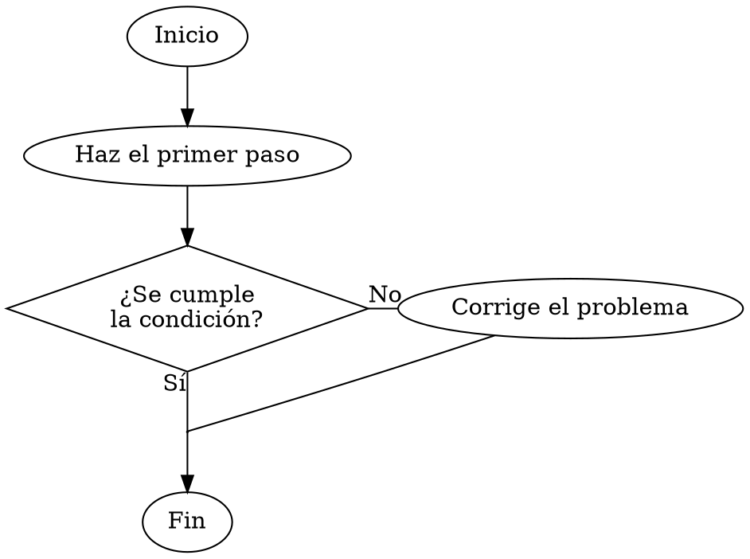
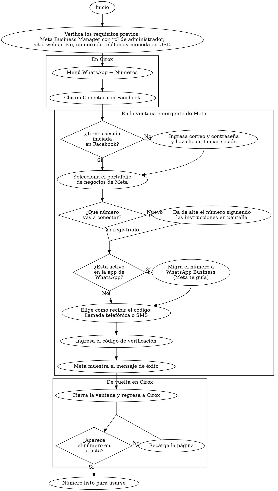

# Diagramas en artículos

El cuerpo de un artículo (Markdown) admite dos motores de diagramas. Ambos se renderizan en el navegador, con los colores del tema (claro y oscuro) y la fuente del sitio; el bloque se carga solo en las páginas que tienen un diagrama.

| Bloque | Motor | Úsalo para |
|---|---|---|
| ` ```dot ` (o ` ```graphviz `) | Graphviz | **Diagramas de flujo clásicos**: rombos de decisión con el "Sí" hacia abajo y el "No" saliendo por un lado. |
| ` ```mermaid ` | Mermaid 12 | Secuencia, estados, clases, entidad-relación, Gantt, línea de tiempo, mapas mentales, etc. |

> Mermaid no permite fijar por qué lado sale cada rama de un rombo; por eso los diagramas de flujo de procedimientos van en Graphviz.

## Plantilla de diagrama de flujo (Graphviz)



## Reglas

1. **Camino principal:** pon `group=principal` en todos los nodos del camino "feliz" (incluidos los puntos de unión). Así las flechas entran y salen por las puntas de los rombos.
2. **Rama lateral:** declara el nodo de la rama en la misma fila que el rombo con `{ rank=same; rombo; rama; }` y conéctalo con `rombo:e -> rama:w`.
3. **Etiquetas de las ramas:** usa `taillabel="Sí"` en las flechas que salen de un rombo: la etiqueta queda junto a la punta del rombo. Para otras flechas, `xlabel="…"`. Nunca uses `label=`: las líneas son ortogonales y Graphviz no la coloca.
4. **Unir ramas:** cuando dos caminos se juntan antes de un nodo, usa un punto de unión (`shape=point, width=0.01, height=0.01`) y conecta las ramas a él con `arrowhead=none`. No apuntes varias flechas directamente a un rombo: con líneas ortogonales la flecha puede quedar flotando junto al rombo.
5. **Bucles (volver a intentar):** se resuelven igual, con un punto de unión antes del paso al que se vuelve. Ejemplo: `recarga -> union2 [arrowhead=none]`, con `cierra -> union2 [arrowhead=none]; union2 -> aparece;`.
6. **Saltos de línea:** Graphviz no ajusta el texto solo. Corta las líneas con `\n`. En los rombos, usa 2–3 líneas cortas (de unas 12–18 letras): el rombo crece el doble que su texto.
7. **Agrupar por pantalla o actor:** usa `subgraph cluster_nombre { label="En Cirox"; ... }`. El nombre debe empezar con `cluster_`. Declara dentro del cluster todos sus nodos, incluidos los puntos de unión.
8. **Formas:** `shape=oval` para inicio y fin, `shape=diamond` para decisiones; los pasos no llevan `shape`.
9. **No pongas colores, fuentes ni estilos** (`color`, `fillcolor`, `fontname`, `style`…): el portal aplica los del tema y los adapta al modo oscuro. Los rombos se dibujan con puntas rectas automáticamente para que las líneas toquen el vértice.
10. **Dirección:** usa la dirección por defecto (de arriba hacia abajo). No uses `rankdir=LR` en diagramas con bucles: las líneas de retorno atraviesan los nodos.
11. **Resumen en texto:** acompaña cada diagrama de flujo con los pasos en una lista numerada o un párrafo. Los lectores de pantalla no siguen el orden del diagrama, y el texto también sirve para buscar.

## Qué se bloquea por seguridad

- **Graphviz:** el SVG se sanitiza con DOMPurify. Se eliminan los enlaces (`URL`, `href`), las imágenes (`image`), los estilos, los `id` y las clases (`class`). El código fuente tiene un máximo de 20 000 caracteres.
- **Mermaid:** se renderiza con `securityLevel: 'strict'`. Las directivas `%%{init}%%` y el `config:` del frontmatter no pueden cambiar el tema, el CSS, la fuente ni el layout.
- Si un diagrama tiene un error de sintaxis, se muestra "No se pudo renderizar el diagrama." y el detalle queda en la consola del navegador.

## Ejemplo completo: conectar un número de WhatsApp



## Probar un diagrama antes de publicarlo

- Graphviz: [Graphviz Online](https://dreampuf.github.io/GraphvizOnline/). Agrega `graph [splines=ortho];` al principio para ver las líneas como en el portal.
- Mermaid: [Mermaid Live Editor](https://mermaid.live/).

Los colores y la fuente finales son los del portal; los editores online solo validan la estructura.

## Implementación

- `src/lib/utils/markdown.ts`: convierte los bloques `mermaid`, `dot` y `graphviz` en `<div class="diagram-wrapper" data-engine="…">` con el código fuente oculto.
- `src/components/pages/ArticlePage.astro`: carga bajo demanda el renderizador de cada motor.
- `src/lib/client/graphviz-renderer.ts`: inyecta los estilos del tema en el DOT, ejecuta Graphviz (WASM, `@hpcc-js/wasm-graphviz`), sanitiza el SVG y compensa el ancho de la fuente del sitio.
- `src/lib/client/mermaid-renderer.ts`: configura Mermaid con el tema y bloquea las directivas.
- `src/lib/client/diagram-theme.ts`: lectura de colores del tema, re-render serializado al cambiar de tema y salida en el DOM.
- `src/styles/global.css`: sección "Diagrams".
